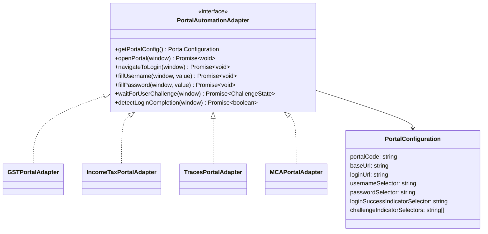
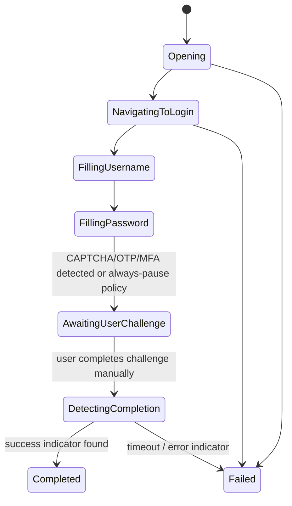

# Browser Automation Design

## 1. Requirement Recap

Open an official portal, navigate to login, fill username/password from the vault, then stop
and hand control to the human for CAPTCHA/OTP/MFA — never attempt to solve or bypass those.
Must work reliably across GST, Income Tax, TRACES, MCA, EPFO, ESIC, DGFT, and future portals,
each with different DOM structures.

## 2. Options Evaluated

| Option | Security | Reliability | Maintainability | UX | Verdict |
|---|---|---|---|---|---|
| **Tauri WebView (WebView2 on Windows)** | High — isolated window, no extra binaries, TLS handled by OS-shipped Edge runtime | High — WebView2 is evergreen (auto-updates with Windows/Edge), well-documented DOM automation via `executeScript`-style injection | Good — same web tech (CSS selectors) the team already uses; one runtime to support | Native-feeling, opens inside/alongside the app, no extra window chrome oddities | **Chosen** |
| System default browser (Chrome/Edge/Firefox, whatever the user has) | Lower — app has no reliable automation hook into an arbitrary already-open browser without a companion extension | Low — behavior varies per browser/version, harder to guarantee selector stability | Poor — must support N browsers | Familiar browser, but no reliable autofill without an extension anyway | Rejected as primary; kept as manual "open in browser" fallback link with no autofill |
| Playwright/Puppeteer (bundled Chromium, driven by the desktop app) | Medium — bundling a second Chromium increases attack surface & binary size; automation frameworks are also the toolkit most associated with bypassing bot defenses, inviting misuse even if unintended | Medium-High — very capable automation API | Medium — extra binary to ship/update, larger install size | Slower cold start, a visibly "different" browser window than the rest of the app | Rejected for the primary path (see §3); documented as a possible **headless-disabled, visible-only** fallback for a portal WebView2 cannot render correctly, never used to solve challenges |
| Browser extension (Chrome/Edge extension doing the autofill) | Medium — extension permissions model is broad, users must trust+install separately, harder to keep scoped | Medium — extension store review/update cadence adds friction | Poor — separate release pipeline, separate update mechanism from the desktop app | Extra install step, breaks the "one app" experience | Rejected for MVP; reconsider only if a portal actively blocks WebView2 embedding |

## 3. Decision: Tauri-hosted WebView2, Visible, User-Driven

The automation window is **always visible** to the user (never headless) — this is a
deliberate security property, not just a UX choice: a headless automation window is exactly
the shape of tooling used to bypass CAPTCHA/anti-bot controls, and this product must never even
resemble that. Playwright is explicitly avoided as the primary engine for the same reason —
its ecosystem is dominated by headless/stealth use cases, and depending on it invites scope
creep toward "just auto-solve it" that this product must never do. WebView2's automation hook
(`executeScript` via Tauri's window API) is used only for the two narrowly-scoped actions
described in §5: fill username, fill password. It is never used to read page content back for
CAPTCHA solving, never used to intercept network requests, and never used to inject scripts
after the login form is submitted.

## 4. Portal Adapter Abstraction

- Each adapter is an isolated Rust module (`desktop/src-tauri/src/portals/gst.rs`, etc.)
  implementing a shared `PortalAutomationAdapter` trait. **Selectors and portal-specific
  quirks live only inside the adapter file** — never scattered through generic app code, per
  the codebase-wide "no portal selectors outside adapters" rule.
- `PortalConfiguration` for most portals is *data* (selectors, URLs) loaded from the backend's
  `portals.config_schema` — adding a straightforward new portal is a config change; a genuinely
  quirky portal (odd multi-step login, iframe-nested form) gets a small dedicated adapter
  implementation.
- Adapters are versioned; when a portal changes its DOM, only that adapter needs an update and
  a release, not the core engine.

## 5. State Machine

- The engine transitions to `AwaitingUserChallenge` **unconditionally** after filling
  password — it does not attempt to detect "is there a CAPTCHA" and skip the pause; the pause
  is the default, safe behavior for every portal, every time. Some adapters may additionally
  surface *which* challenge is showing (CAPTCHA vs OTP vs none) purely to show the user a
  helpful message ("Complete CAPTCHA to continue" / "Enter the OTP sent to your registered
  mobile"), but that is cosmetic — the human always drives past this point regardless.
- `detectLoginCompletion` polls for a success indicator (e.g. a post-login nav element)
  already-visible-page-only, with a generous timeout and a manual "I've completed login,
  continue" button as a fallback if detection is ambiguous — automation must never claim
  success it hasn't verified from visible page state.
- Every state transition is reported to the backend (`POST /portal-sessions/:id/events`) for
  the audit trail (`PORTAL_SESSION_STARTED`/`PORTAL_OPENED`/`PORTAL_SESSION_COMPLETED`/`PORTAL_SESSION_FAILED`),
  without ever including page content or field values in the event payload.

## 6. What the Engine Will Never Do

- Read, screenshot, OCR, or forward a CAPTCHA image/challenge to any solving service, human or
  automated, in-house or third-party.
- Auto-submit an OTP/MFA code, including one intercepted from a linked SMS/email inbox.
- Retry a failed login in a tight loop, rotate IP/user-agent, or otherwise evade rate limiting
  or anti-bot detection.
- Persist or reuse a portal's authenticated session cookie across app restarts to skip login —
  each portal session starts a fresh, user-authenticated browser context.
- Execute arbitrary/dynamic script from a remote source inside the portal WebView — only the
  two fixed, reviewed `fillUsername`/`fillPassword` scripts ship in the adapter code itself.

## 7. Adding a New Portal (checklist)

1. Add a `portals` catalog row (code, base URL, login URL) via backend/admin tooling.
2. If selectors are simple: supply `config_schema` (username/password selectors, success
   indicator) — no code change needed, the generic adapter handles it.
3. If the login flow is non-trivial (multi-step, iframe, JS-rendered late): implement a small
   Rust adapter module implementing `PortalAutomationAdapter`, register it in the adapter
   registry keyed by `portalCode`.
4. Manual QA: verify the engine fills only the two intended fields and reliably pauses before
   any challenge, on a real login attempt.
5. Ship behind the existing desktop auto-update channel.

**Status (docs/development-roadmap.md, Phase 5):** all seven seeded portals have a registry
entry following steps 1–3 as data-only config, GST's being the one dedicated adapter module.

**Step 4 has now actually run for GST** — real manual QA, not a formality skipped. Live-tested
against the real, rendered `services.gst.gov.in` login page in both automation surfaces this
project has (the desktop app and the browser extension, §8): username and password were
filled correctly (verified by direct visual inspection of the running app, not assumed), the
CAPTCHA field was confirmed untouched, and the engine correctly waited out the portal's own
Angular render delay before filling — a real timing bug (fixed: both surfaces now poll for the
fields to exist for up to ~10s instead of a one-shot fill immediately after opening the page,
since `open_portal_window`/`chrome.tabs.create` resolve once the tab exists, not once the
portal's own JS has finished rendering the form) that a code read alone would not have caught.
**MCA is now confirmed too**, live-tested in the desktop app on 2026-08-26 against
`https://www.mca.gov.in/content/mca/global/en/foportal/fologin.html` (MCA's actual V3 sign-in
page — its old V2 login was retired 2025-06-18 and the registry's `login_url` was dead until this
pass). This one took more than a timing fix: MCA blocks automated fetches and runs an
anti-devtools script on the page, so the field selectors had to be confirmed by reading
view-source by hand rather than inspected live like GST's, and a one-shot fill wasn't enough — MCA
server-renders the login `<input>`s, then its own JS (Adobe AEM Adaptive Forms) rebuilds that part
of the DOM shortly after, silently discarding a fill that landed before the rebuild. Fixed by
having `build_fill_script` keep re-asserting the values until they've held steady for two
consecutive polls rather than filling once and stopping — a fix that applies to every portal, not
just MCA, since any framework that re-renders shortly after initial paint would hit the same race.
User ID and Password were both confirmed visually filled in the running desktop app; CAPTCHA/OTP
were left untouched.

**INCOME_TAX is now confirmed too**, live-tested in the desktop app on 2026-08-26 against
`https://eportal.incometax.gov.in/iec/foservices/#/login` — the hardest of the three. Its login is
a genuine two-screen wizard (a User ID screen with its own "Continue" button client-side-routes to
a separate Password screen whose `<input>` doesn't exist until that happens), which meant three
real, distinct bugs before it actually worked, each found live rather than by code review:
- The username field's own id was inconsistent between renders (`panAadhaarUserId` in one session,
  `panAdhaarUserId` — one fewer "a" — in another), so the selector matches both.
- A visibility guard added to dodge a hidden duplicate element used `offsetParent !== null`, a
  common but broken check that false-negatives for `position: fixed` elements — switched to
  `getClientRects().length > 0`.
- The fill script itself computed "which screen am I on" once at start-up instead of on every
  poll tick, and separately stopped itself the instant it clicked "Continue" (mistaking the
  still-filled username field's stability for being fully done) — so it never got a real chance to
  reach the password field even though its own polling loop kept running (a Tauri `on_page_load`
  hook to re-inject on navigation was built as a fix first, but live logging showed that event
  never fires for this portal's hash-only routing, meaning the script's execution context was
  surviving fine all along — the actual bug was purely in what the running script checked and
  when). See `apps/desktop/src-tauri/src/portals/income_tax.rs`'s module comment for the full
  trail; the extension's `fillCredentialFields` in `apps/extension/portals.js` carries the same
  fixes, using `chrome.webNavigation` to re-inject on each screen instead (a real Chrome tab
  navigation, unlike the desktop webview here, does reliably need that).

Every other portal in the registry remains an unverified placeholder — three confirmed adapters
(GST, MCA, INCOME_TAX) is not a blanket claim about the rest (TRACES, EPFO, ESIC, DGFT).

## 8. Browser Extension (Web Autofill)

The desktop app's Rust core can reach into its own isolated WebView2/WebKitGTK window because
Tauri gives it that control. A web page cannot do the equivalent to a different tab it opens —
browsers enforce that boundary deliberately, for the same reason a website can't script another
website's login form. The only way to get real autofill from a *browser* rather than the
desktop app is the same mechanism every password manager's browser integration uses: a browser
extension, which the user explicitly grants permission to reach into a page's DOM.

`apps/extension` (Manifest V3, Chrome/Edge) implements exactly the same contract as the
desktop app, deliberately "dumb" in the same way (docs/desktop-architecture.md §3): the web
app's own React code owns all business logic — creating the portal session via the normal
authenticated API, reporting lifecycle events, showing the CAPTCHA-wait UI. The extension's
background service worker does exactly one thing when asked: redeem a portal-session's
one-time token for the transient plaintext credential, open the portal tab, and fill the two
configured fields using the same polling-fill approach as the Rust adapter — then stop. See
[apps/extension/README.md](../apps/extension/README.md) for the install flow (unpacked/
developer-mode only, no Chrome Web Store listing) and the exact message protocol between the
web app and the extension (`chrome.runtime.sendMessage` via `externally_connectable`, scoped
to a fixed, known extension id — never "any extension that answers").
