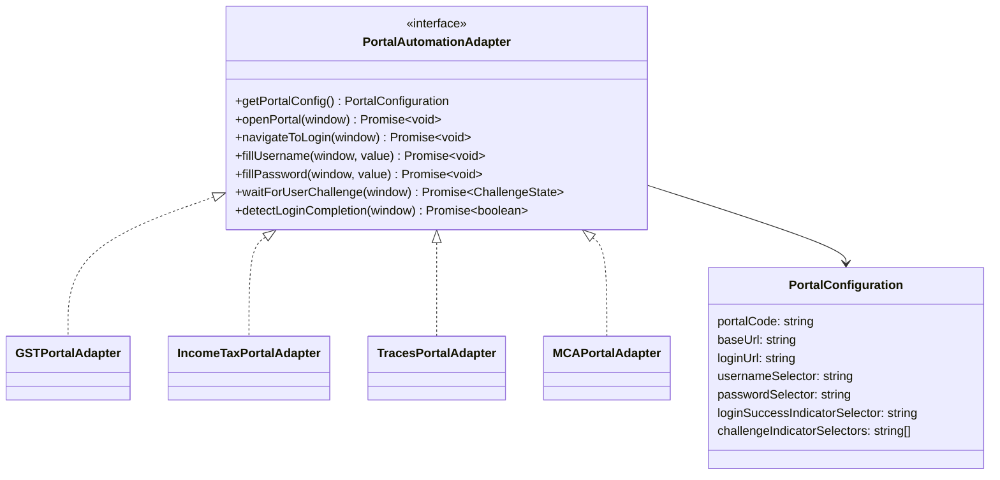
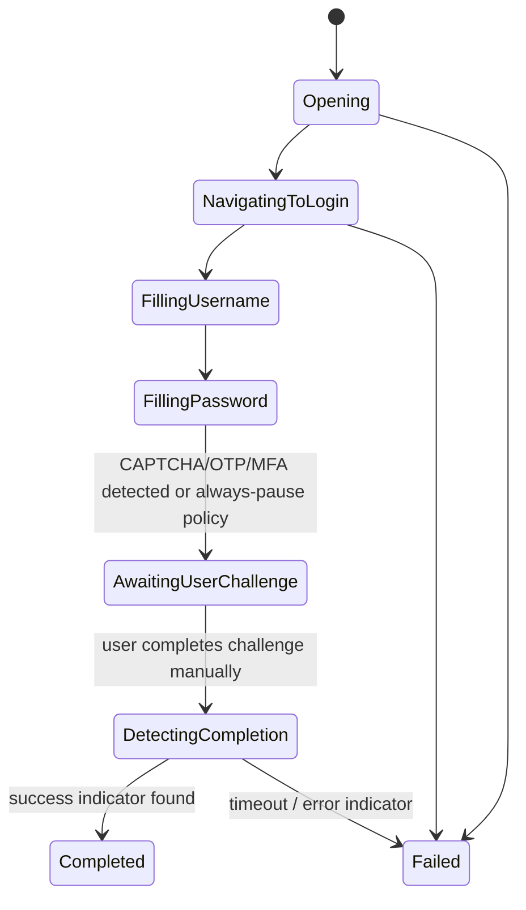

# Browser Automation Design

## 1. Requirement Recap

Open an official portal, navigate to login, fill username/password from the vault, then stop
and hand control to the human for CAPTCHA/OTP/MFA — never attempt to solve or bypass those.
Must work reliably across GST, Income Tax, TRACES, MCA, EPFO, ESIC, DGFT, and future portals,
each with different DOM structures.

## 2. Options Evaluated

| Option | Security | Reliability | Maintainability | UX | Verdict |
|---|---|---|---|---|---|
| **Tauri WebView (WebView2 on Windows)** | High — isolated window, no extra binaries, TLS handled by OS-shipped Edge runtime | High — WebView2 is evergreen (auto-updates with Windows/Edge), well-documented DOM automation via `executeScript`-style injection | Good — same web tech (CSS selectors) the team already uses; one runtime to support | Native-feeling, opens inside/alongside the app, no extra window chrome oddities | **Chosen** |
| System default browser (Chrome/Edge/Firefox, whatever the user has) | Lower — app has no reliable automation hook into an arbitrary already-open browser without a companion extension | Low — behavior varies per browser/version, harder to guarantee selector stability | Poor — must support N browsers | Familiar browser, but no reliable autofill without an extension anyway | Rejected as primary; kept as manual "open in browser" fallback link with no autofill |
| Playwright/Puppeteer (bundled Chromium, driven by the desktop app) | Medium — bundling a second Chromium increases attack surface & binary size; automation frameworks are also the toolkit most associated with bypassing bot defenses, inviting misuse even if unintended | Medium-High — very capable automation API | Medium — extra binary to ship/update, larger install size | Slower cold start, a visibly "different" browser window than the rest of the app | Rejected for the primary path (see §3); documented as a possible **headless-disabled, visible-only** fallback for a portal WebView2 cannot render correctly, never used to solve challenges |
| Browser extension (Chrome/Edge extension doing the autofill) | Medium — extension permissions model is broad, users must trust+install separately, harder to keep scoped | Medium — extension store review/update cadence adds friction | Poor — separate release pipeline, separate update mechanism from the desktop app | Extra install step, breaks the "one app" experience | Rejected for MVP; reconsider only if a portal actively blocks WebView2 embedding |

## 3. Decision: Tauri-hosted WebView2, Visible, User-Driven

The automation window is **always visible** to the user (never headless) — this is a
deliberate security property, not just a UX choice: a headless automation window is exactly
the shape of tooling used to bypass CAPTCHA/anti-bot controls, and this product must never even
resemble that. Playwright is explicitly avoided as the primary engine for the same reason —
its ecosystem is dominated by headless/stealth use cases, and depending on it invites scope
creep toward "just auto-solve it" that this product must never do. WebView2's automation hook
(`executeScript` via Tauri's window API) is used only for the two narrowly-scoped actions
described in §5: fill username, fill password. It is never used to read page content back for
CAPTCHA solving, never used to intercept network requests, and never used to inject scripts
after the login form is submitted.

## 4. Portal Adapter Abstraction

- Each adapter is an isolated Rust module (`desktop/src-tauri/src/portals/gst.rs`, etc.)
  implementing a shared `PortalAutomationAdapter` trait. **Selectors and portal-specific
  quirks live only inside the adapter file** — never scattered through generic app code, per
  the codebase-wide "no portal selectors outside adapters" rule.
- `PortalConfiguration` for most portals is *data* (selectors, URLs) loaded from the backend's
  `portals.config_schema` — adding a straightforward new portal is a config change; a genuinely
  quirky portal (odd multi-step login, iframe-nested form) gets a small dedicated adapter
  implementation.
- Adapters are versioned; when a portal changes its DOM, only that adapter needs an update and
  a release, not the core engine.

## 5. State Machine

- The engine transitions to `AwaitingUserChallenge` **unconditionally** after filling
  password — it does not attempt to detect "is there a CAPTCHA" and skip the pause; the pause
  is the default, safe behavior for every portal, every time. Some adapters may additionally
  surface *which* challenge is showing (CAPTCHA vs OTP vs none) purely to show the user a
  helpful message ("Complete CAPTCHA to continue" / "Enter the OTP sent to your registered
  mobile"), but that is cosmetic — the human always drives past this point regardless.
- `detectLoginCompletion` polls for a success indicator (e.g. a post-login nav element)
  already-visible-page-only, with a generous timeout and a manual "I've completed login,
  continue" button as a fallback if detection is ambiguous — automation must never claim
  success it hasn't verified from visible page state.
- Every state transition is reported to the backend (`POST /portal-sessions/:id/events`) for
  the audit trail (`PORTAL_SESSION_STARTED`/`PORTAL_OPENED`/`PORTAL_SESSION_COMPLETED`/`PORTAL_SESSION_FAILED`),
  without ever including page content or field values in the event payload.

## 6. What the Engine Will Never Do

- Read, screenshot, OCR, or forward a CAPTCHA image/challenge to any solving service, human or
  automated, in-house or third-party.
- Auto-submit an OTP/MFA code, including one intercepted from a linked SMS/email inbox.
- Retry a failed login in a tight loop, rotate IP/user-agent, or otherwise evade rate limiting
  or anti-bot detection.
- Persist or reuse a portal's authenticated session cookie across app restarts to skip login —
  each portal session starts a fresh, user-authenticated browser context.
- Execute arbitrary/dynamic script from a remote source inside the portal WebView — only the
  two fixed, reviewed `fillUsername`/`fillPassword` scripts ship in the adapter code itself.

## 7. Adding a New Portal (checklist)

1. Add a `portals` catalog row (code, base URL, login URL) via backend/admin tooling.
2. If selectors are simple: supply `config_schema` (username/password selectors, success
   indicator) — no code change needed, the generic adapter handles it.
3. If the login flow is non-trivial (multi-step, iframe, JS-rendered late): implement a small
   Rust adapter module implementing `PortalAutomationAdapter`, register it in the adapter
   registry keyed by `portalCode`.
4. Manual QA: verify the engine fills only the two intended fields and reliably pauses before
   any challenge, on a real login attempt.
5. Ship behind the existing desktop auto-update channel.
