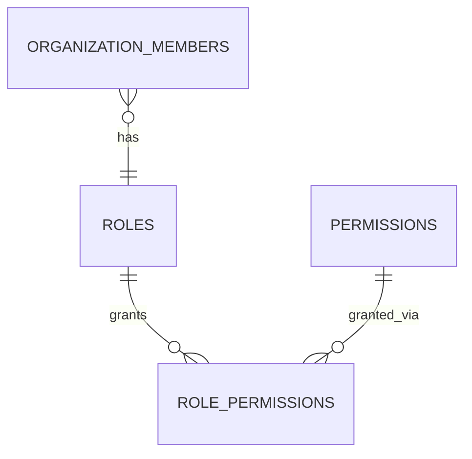

# Database Design

Engine: PostgreSQL 16. ORM: Prisma. All primary keys `uuid` (`gen_random_uuid()`, pgcrypto).
All tables: `created_at`, `updated_at` (`timestamptz`); tenant-sensitive tables additionally
carry `deleted_at` for soft deletion. All tenant-sensitive tables carry `organization_id`.

## 1. Multi-Tenancy Strategy

**Shared database, shared schema, `organization_id` on every tenant-sensitive row** —
chosen over database-per-tenant or schema-per-tenant because it gives the simplest
operational model (one set of migrations, one connection pool) while the platform is small
enough that a few hundred/thousand firms comfortably fit one well-indexed Postgres instance.
Trade-off: isolation is enforced by code + RLS, not by physical separation — accepted because
those two layers together are the industry-standard control for this scale, and physical
per-tenant separation can still be introduced later for any firm with a contractual
requirement for it (Prisma's multi-schema support allows a "premium isolation" tier without a
platform rewrite).

Two layers of enforcement:

1. **Application layer (primary):** every repository method requires an `organizationId` and
   every generated Prisma query is built through a base repository that injects
   `WHERE organization_id = :orgId` — there is no code path that queries a tenant table without
   it. `TenantScopeGuard` derives `orgId` from the verified JWT, never from the request body/URL.
2. **Database layer (defense-in-depth):** PostgreSQL Row-Level Security policies on every
   tenant table, keyed to a session variable (`SET app.current_org_id`) set at the start of
   each request's transaction. Even a bug that skips the application-layer filter cannot leak
   cross-tenant rows.

## 2. Core Tables

### users
Platform-level identity (a user can belong to multiple organizations).

| Column | Type | Notes |
|---|---|---|
| id | uuid PK | |
| email | citext unique | |
| password_hash | text | Argon2id |
| full_name | text | |
| phone | text null | |
| status | enum(active, suspended, pending_verification) | |
| email_verified_at | timestamptz null | |
| mfa_enabled | boolean default false | TOTP, future |
| mfa_secret_encrypted | text null | envelope-encrypted if set |
| last_login_at | timestamptz null | |
| created_at, updated_at | timestamptz | |

### organizations (firms)

| Column | Type | Notes |
|---|---|---|
| id | uuid PK | |
| name | text | |
| slug | text unique | |
| status | enum(active, suspended, trial) | |
| plan | text | subscription tier, future billing hook |
| settings | jsonb | firm-level settings (e.g. session timeout policy) |
| created_at, updated_at | timestamptz | |

### organization_members

| Column | Type | Notes |
|---|---|---|
| id | uuid PK | |
| organization_id | uuid FK → organizations | |
| user_id | uuid FK → users | |
| role_id | uuid FK → roles | |
| status | enum(active, invited, disabled) | |
| invited_by | uuid FK → users null | |
| joined_at | timestamptz null | |
| unique(organization_id, user_id) | | |

### roles / permissions (RBAC — see §RBAC below)

### clients

| Column | Type | Notes |
|---|---|---|
| id | uuid PK | |
| organization_id | uuid FK | indexed |
| name | text | |
| entity_type | enum(individual, proprietorship, partnership, llp, private_limited, public_limited, trust, society, huf, other) | extensible via lookup table if needed later |
| pan | text null | indexed, format-validated |
| gstin | text null | indexed |
| tan | text null | indexed |
| cin | text null | indexed |
| address | jsonb null | |
| email | citext null | |
| phone | text null | |
| contact_person | text null | |
| financial_year | text null | e.g. "2025-26" |
| assessment_year | text null | e.g. "2026-27" |
| status | enum(active, inactive, onboarding, offboarded) | |
| notes | text null | |
| tags | text[] | GIN indexed |
| created_by | uuid FK → users | |
| deleted_at | timestamptz null | soft delete |
| created_at, updated_at | timestamptz | |

Indexes: `(organization_id, pan)`, `(organization_id, gstin)`, `(organization_id, tan)`,
`(organization_id, cin)`, `(organization_id, name)` trigram (`pg_trgm`) for fuzzy search,
GIN on `tags`.

### client_contacts
Additional contacts per client (director, accountant, spouse, etc.): `id, client_id, name, role, email, phone, is_primary`.

### client_assignments
Which employees work on which client: `id, client_id, organization_member_id, assigned_role
(e.g. "GST lead"), assigned_at, unassigned_at null`.

### portals

Global catalog, not tenant-scoped (platform-managed): `id, code (GST, INCOME_TAX, TRACES,
MCA, EPFO, ESIC, DGFT, ...), name, category, base_url, login_url, is_active,
automation_adapter_key, config_schema jsonb`. `config_schema` documents what fields a
`portal_account` for this portal type needs (e.g. GST needs GSTIN + username; Income Tax needs
PAN + username) — this is what lets new portals be added via data, not code, for anything
short of new automation behavior.

### portal_accounts
A client's account on a given portal: `id, organization_id, client_id, portal_id, identifier
(e.g. GSTIN/PAN), display_username, status (active, needs_update, disabled), last_verified_at,
created_at, updated_at`. One client can have multiple accounts per portal type (e.g. multiple
GSTINs for multi-state registration).

### credentials
The vault. **No plaintext ever stored.**

| Column | Type | Notes |
|---|---|---|
| id | uuid PK | |
| organization_id | uuid FK | |
| portal_account_id | uuid FK → portal_accounts | |
| payload_ciphertext | bytea | AES-256-GCM ciphertext of the JSON `{username, password}` payload — one payload, one DEK, one nonce |
| encryption_nonce | bytea | unique per record |
| wrapped_data_key | bytea | per-credential DEK, wrapped directly by the environment KEK |
| key_version | int | which KEK version wrapped this DEK (rotation support) |
| algorithm | text | e.g. "AES-256-GCM" (versioned for future migration) |
| status | enum(active, needs_rotation, revoked) | |
| last_used_at | timestamptz null | |
| last_rotated_at | timestamptz null | |
| created_by | uuid FK → users | |
| deleted_at | timestamptz null | |
| created_at, updated_at | timestamptz | |

See [security-design.md](security-design.md) §5 for the full encryption flow.

### credential_access_logs
Append-only, never updated/deleted: `id, credential_id, organization_id, user_id, action
(VIEWED_METADATA, USED, REVEALED, ROTATED, CREATED, UPDATED, DELETED), ip_address, user_agent,
portal_session_id null, created_at`. Never contains plaintext.

### portal_sessions / portal_session_events
`portal_sessions`: `id, organization_id, client_id, credential_id, initiated_by, status
(PENDING, CREDENTIAL_ISSUED, AWAITING_USER_CHALLENGE, COMPLETED, FAILED, EXPIRED),
one_time_token_hash (sha256 of the token handed to the desktop app — the raw token itself is
never stored), one_time_token_used_at null, expires_at, created_at, updated_at`. One row per
"open this portal" workflow (docs/browser-automation-design.md §5). `portal_session_events`:
`id, portal_session_id, type, created_at` — the desktop app's state-machine transitions,
append-only, never containing page content or field values.

### documents
Metadata only; bytes live in object storage.

`id, organization_id, client_id null, category_id, file_name, storage_key, mime_type,
size_bytes, checksum_sha256, tags text[], uploaded_by, access_level (organization, assigned_employees, specific_users), created_at, updated_at, deleted_at`.

### document_categories
`id, organization_id null (null = global default set), name, parent_id null` (supports folder-like nesting).

### document_permissions
`id, document_id, organization_member_id null, role_id null` — explicit grants when
`access_level = specific_users`.

### tasks
`id, organization_id, client_id null, portal_account_id null, title, description, status
(TODO, IN_PROGRESS, WAITING, COMPLETED, CANCELLED), priority (LOW, MEDIUM, HIGH, URGENT),
due_date, assigned_to (organization_member_id) null, created_by, recurrence_rule jsonb null
(RRULE-like), parent_task_id null (for recurrence instances), created_at, updated_at, deleted_at`.

### task_comments
`id, task_id, author_id, body, created_at`.

### task_attachments
`id, task_id, document_id` (reuses the document store, no duplicate upload path).

### compliance_types (configurable framework — not hard-coded rules)
`id, organization_id null (null = platform-provided default), code (e.g. GSTR3B, GSTR1, ITR,
TDS_24Q), name, category (GST, INCOME_TAX, TDS, MCA, OTHER), periodicity (monthly, quarterly,
annually, event_based), default_due_rule jsonb (e.g. "20th of next month")`. Keeping this a
data table (not an enum baked into `compliance_items`) is what lets due-date rules and new
filing types be added without a schema migration.

### compliance_items
`id, organization_id, client_id, compliance_type_id, financial_year, assessment_year null,
due_date, filing_date null, status (UPCOMING, IN_PROGRESS, FILED, VERIFIED, OVERDUE,
NOT_APPLICABLE), assigned_to null, notes null, created_at, updated_at`. Linked documents via
`document.category` or a `compliance_item_documents` join table.

### notifications
`id, organization_id, user_id, type, title, body, related_entity_type null, related_entity_id
null, channel (in_app, email, desktop), read_at null, sent_at null, created_at`.

### audit_logs
Append-only.

`id, organization_id null (null for platform-level events), actor_user_id null (null for
system), action (enum, see [security-design.md](security-design.md) §8 for the full catalog),
resource_type, resource_id null, result (success, failure), ip_address null, user_agent null,
metadata jsonb (non-sensitive context only), created_at`.

Partitioned by month once volume warrants it (`created_at` range partitioning); indexed on
`(organization_id, created_at desc)` and `(resource_type, resource_id)`.

### sessions
`id, user_id, organization_id null (active org context), device_info jsonb, ip_address,
created_at, last_seen_at, expires_at, revoked_at null`.

### refresh_tokens
`id, session_id, token_hash (never store raw token), family_id (for rotation/reuse
detection), created_at, expires_at, revoked_at null, replaced_by_id null`.

### settings
`id, organization_id, key, value jsonb, updated_by, updated_at` — per-firm configurable
settings (session timeout, notification preferences, compliance defaults override).

## 3. RBAC Schema

- `roles`: `id, organization_id null (null = platform system role), name, is_system, created_at`.
  System roles seeded: `SUPER_ADMIN` (platform, no org), `FIRM_ADMIN`, `CA`, `MANAGER`,
  `ACCOUNTANT`, `STAFF`, `READ_ONLY`. Firms may define custom roles later (extensible without
  schema change since permissions are data, not code branches).
- `permissions`: `id, code (e.g. "clients.view", "credentials.use"), description, category`.
- `role_permissions`: `role_id, permission_id` join table.

Permission catalog (initial): `clients.view/create/update/delete`,
`credentials.view/create/update/delete/use`, `documents.view/upload/delete`,
`tasks.view/create/assign/complete`, `compliance.view/manage`, `employees.manage`,
`reports.view`, `audit_logs.view`, `settings.manage`. Enforcement detail:
[security-design.md](security-design.md) §4.

## 4. Indexing Notes

- `pg_trgm` extension for fuzzy name/PAN/GSTIN search (`GIN ... gin_trgm_ops`).
- Every FK has a matching btree index (Prisma does this by default; verified in migration review).
- `audit_logs(organization_id, created_at desc)` for the activity feed's dominant query shape.
- `tasks(organization_id, assigned_to, status, due_date)` composite for "my open tasks" queries.
- `compliance_items(organization_id, status, due_date)` for the deadline-scanning worker.

## 5. Migrations

Prisma Migrate, one migration per PR, reviewed like code. No destructive migration (drop
column/table) ships without a two-step deprecate-then-remove process once real tenant data
exists.
