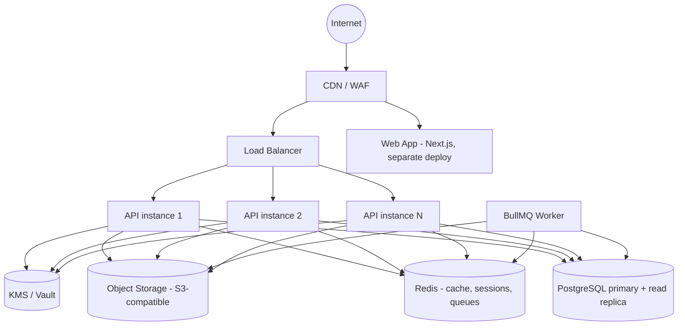

# Deployment Architecture

## 1. Production Topology

- **Web app**: deployed independently (e.g. Vercel or a Node server behind the same CDN/WAF) —
  decoupled release cadence from the API.
- **API**: containerized (Docker), stateless, horizontally scaled behind the load balancer;
  session/refresh-token state lives in Redis/Postgres, not in-process, so any instance can
  serve any request.
- **Workers**: separate deployable process (same codebase, different entrypoint) for
  document AV scanning, notification dispatch, compliance deadline scans, credential
  rotation jobs — isolated so a slow job never blocks API request latency.
- **Desktop app**: not part of this server topology — distributed as a signed installer (see
  [desktop-architecture.md](desktop-architecture.md) §7).

## 2. Environments

`local` (Docker Compose) → `staging` → `production`. Staging mirrors production topology at
smaller scale and is the required gate for any change touching auth, credentials, or tenant
isolation.

## 3. Local Development

`infrastructure/docker-compose.yml` provides Postgres, Redis, and an S3-compatible object
store (MinIO) so the full stack runs locally without cloud dependencies. `.env.example` at the
repo root documents every required variable with placeholder values — real secrets are never
committed.

## 4. CI/CD

Pipeline stages (GitHub Actions), gating merge to `main`:

1. Install (cached pnpm store).
2. Type check (`tsc --noEmit` across all workspaces).
3. Lint (ESLint + Prettier check).
4. Unit tests.
5. Integration tests (against ephemeral Postgres/Redis service containers).
6. Build (api, web).
7. Security checks: `npm audit`/`pnpm audit`, secret-scanning (gitleaks), Prisma migration
   diff review.

Desktop builds run in a **separate workflow** (Windows runner required for the Tauri/WebView2
build), triggered on release tags rather than every PR, producing the signed installer as a
release artifact — kept out of the fast web/API feedback loop.

## 5. Observability

- Structured JSON logging (Pino) with request-correlation IDs, shipped to a log aggregator;
  redaction rules from [security-design.md](security-design.md) §7 applied at the logger level
  so nothing sensitive can reach the aggregator even via a future bug.
- Metrics: request rate/latency/error-rate per route, queue depth/processing time per job
  type, DB pool utilization — exposed via a Prometheus-compatible `/metrics` endpoint (internal
  network only, not public).
- Error tracking: exceptions captured with request context (minus sensitive fields) to an
  error-tracking service.
- Health checks: `GET /health` (liveness — process is up) and `GET /health/ready` (readiness —
  DB/Redis/object-storage reachable), used by the load balancer and orchestrator.

## 6. Backup & Disaster Recovery

| Aspect | Approach |
|---|---|
| PostgreSQL | Automated daily full backups + continuous WAL archiving for point-in-time recovery |
| Object storage | Versioning enabled + cross-region replication |
| Backup encryption | Encrypted at rest with a key independent from the application KEK |
| Retention | 30 days point-in-time, monthly snapshots retained 12 months (adjust to firm compliance needs) |
| RPO target | ≤ 15 minutes (WAL shipping interval) |
| RTO target | ≤ 4 hours (documented runbook: restore latest snapshot + replay WAL + redeploy infra from IaC) |
| Recovery testing | Quarterly restore drill into an isolated environment, verified against a checksum of known test data |

### 6.1 Drill Log

The restore mechanics were actually exercised once against the local dev Postgres (not a
substitute for the quarterly production-scale drill above, which needs the real cross-region/
managed-backup infrastructure this environment doesn't have — but proves the `pg_dump`/
`pg_restore` mechanics and gives a real, not estimated, number for a database this size):

| Run | 2026-08-25, local Docker Postgres 16, ~287 users / 278 orgs / 106 clients / 85 credentials / 904 audit log rows |
|---|---|
| Backup (`pg_dump -Fc`) | 0.12s, 297 KB |
| Restore (`pg_restore` into a fresh database) | 0.22s |
| Data integrity | Row counts identical across all 5 checked tables; a specific known user record confirmed present and unchanged; every credential's `payload_ciphertext` column confirmed **byte-for-byte identical** (md5 of the concatenated column, ordered by id, matched exactly) — restoring doesn't silently corrupt encrypted data; schema fidelity confirmed (59/59 indexes, 27/27 tables present post-restore) |

At this data volume, backup+restore is sub-second — the RPO/RTO targets above are dominated by
WAL-shipping cadence and infrastructure redeploy time, not by the dump/restore step itself,
which will need re-measuring at production data volume as a routine part of each quarterly
drill.

## 7. Secrets Management

All runtime secrets (DB credentials, Redis URL, KEK/KMS access, JWT signing key, object
storage keys) are injected via the deployment platform's secret store (e.g. cloud provider
secrets manager, or Vault for self-hosted) — never committed, never baked into container
images. `.env.example` documents variable names only. Secret rotation is a documented runbook
per secret type, exercised at least annually or immediately on suspected exposure.

## 8. Scaling Levers (in order of complexity)

1. Add API instances behind the load balancer (stateless, trivial).
2. Add Postgres read replicas for read-heavy endpoints (audit logs, search, dashboards).
3. Add worker instances / partition queues by job type.
4. Only if a single Postgres instance becomes the bottleneck: consider extracting the audit
   log (append-only, high volume) to its own datastore before considering any broader
   service split — this is the most likely first pressure point, not a general microservice
   migration.
