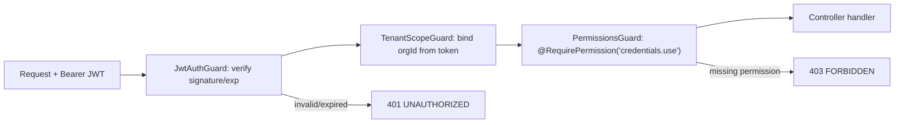
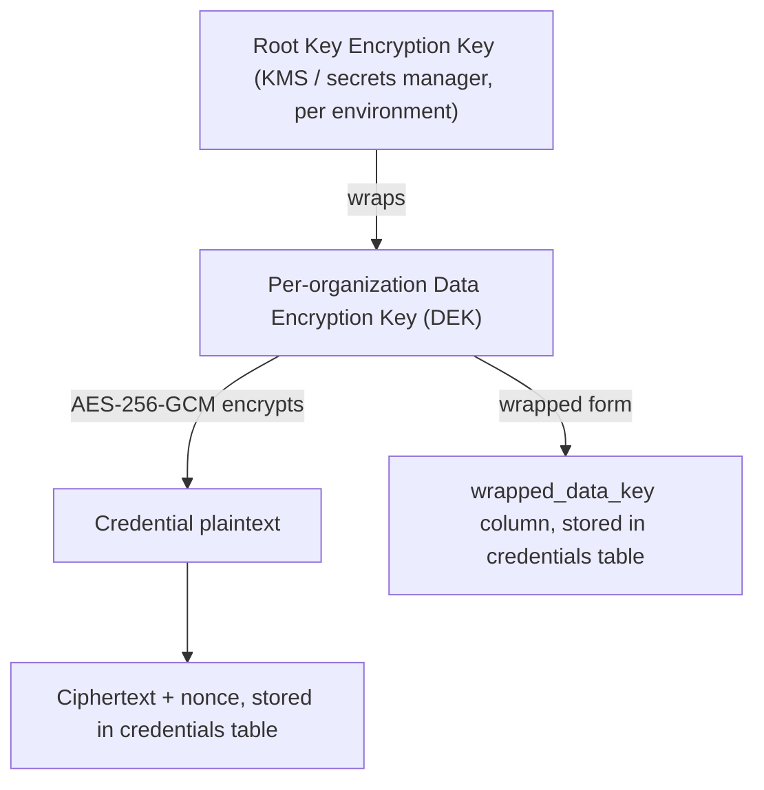

# Security Design

This document is the authority for authentication, authorization, credential-vault
cryptography, and secure-logging rules. Every other doc defers to this one on security
questions.

## 1. Principles

1. Security over convenience, always — no shortcut ever weakens credential protection.
2. Never bypass CAPTCHA/OTP/MFA/rate limits/anti-bot controls, anywhere, for any portal.
3. The backend is the sole authority on authorization; the client (web/desktop) is never trusted.
4. Plaintext secrets exist in memory for the shortest possible time and are never persisted,
   never logged, never cached.
5. Every credential access and every privileged action is audited.

## 2. Authentication

- **Password hashing:** Argon2id (memory-hard, resistant to GPU cracking), tuned to ~250ms on
  reference hardware. Never MD5/SHA/bcrypt-only. Pepper stored in secrets manager, separate
  from the per-password salt Argon2 generates itself.
- **Access token:** JWT (RS256, asymmetric so only the auth service holds the signing key),
  15-minute TTL, contains `sub` (userId), `orgId` (active organization), `sessionId`, role,
  **not** permissions (permissions are resolved server-side per-request from the DB/cache so a
  role change takes effect within the access-token TTL, not just at next login).
- **Refresh token:** opaque random 256-bit token, stored only as a hash (`sha256`) in
  `refresh_tokens`, rotated on every use (`family_id` reuse detection: reusing a
  already-rotated token revokes the entire family and forces re-authentication — signals
  token theft).
  - Web: httpOnly, `Secure`, `SameSite=Strict` cookie.
  - Desktop: OS-secure-storage (Windows Credential Manager / DPAPI) — never a plaintext file.
- **Login throttling:** `@nestjs/throttler` + Redis, exponential backoff per
  `(email, ip)` pair; account lock notification after repeated failures (not permanent
  lockout, to avoid a DoS-by-lockout vector against a legitimate user).
- **Password reset:** single-use, short-TTL signed token emailed to verified address; all
  sessions/refresh tokens for that user are revoked on successful reset.
- **Email verification:** required before first login-with-portal-credential-access; unverified
  accounts can complete setup but the UI blocks credential/portal actions.
- **Future-ready:** the `users` table's `mfa_*` columns and a pluggable
  `AuthStrategy` interface in the `auth` module leave room for TOTP and WebAuthn/passkeys
  without a schema rewrite; SSO (OIDC/SAML) plugs in at the same `AuthStrategy` seam.

## 3. Multi-Tenant Authorization (Tenant Isolation)

Enforced in two independent layers (see [database-design.md](database-design.md) §1):

1. `TenantScopeGuard` reads `orgId` from the **verified JWT only**. Any `organizationId`
   present in a request body or URL param is ignored for authorization purposes — it may only
   be used for resources that are explicitly cross-org (there are none in the MVP).
2. Every Prisma query for a tenant table goes through a base repository
   (`TenantScopedRepository<T>`) whose every method signature requires `organizationId` as its
   first argument — there is no method that can be called without it. Code review checklist
   item: no direct `prisma.<tenantTable>` calls outside the repository layer.
3. Postgres RLS policies (`USING (organization_id = current_setting('app.current_org_id')::uuid)`)
   are enabled on every tenant table as defense-in-depth against an application bug.

**Tenant isolation is a first-class test category** — see [development-roadmap.md](development-roadmap.md#testing-strategy).

## 4. RBAC Enforcement

Request pipeline: `JwtAuthGuard` → `TenantScopeGuard` → `PermissionsGuard` → handler.

- `@RequirePermission('clients.view')` decorator on each handler; `PermissionsGuard` resolves
  the caller's `role_permissions` (cached in Redis, invalidated on role change) and checks
  membership.
- Object-level checks (e.g. "is this client assigned to me" for a `STAFF` role restricted to
  assigned clients) happen in the service layer after the coarse permission check, because
  they need domain data the guard doesn't have.
- Frontend hides UI for actions the user cannot perform, purely as UX — it is never the
  authorization boundary.

## 5. Credential Vault — Encryption Design

**Envelope encryption**, industry-standard pattern (same shape as AWS KMS/GCP KMS envelope
encryption):

- **Algorithm:** AES-256-GCM (authenticated encryption — tampering with ciphertext is
  detected, not just leaked).
- **Key hierarchy:**
  - **KEK (root):** one per environment, lives in a managed secrets service (AWS KMS / GCP
    KMS / HashiCorp Vault — pluggable via a `KeyManagementProvider` interface so self-hosted
    deployments can use Vault while cloud deployments use native KMS; local development uses
    a `LocalKmsProvider` that derives the KEK from an environment secret via HKDF — never
    acceptable in production, enforced by refusing to boot with that provider when
    `NODE_ENV=production`). Never leaves the KMS — only "wrap"/"unwrap" operations cross the
    boundary, the KEK material itself is never fetched into application memory.
  - **DEK (per credential):** implementation refinement from the original per-organization
    DEK design — each credential row gets its own freshly generated 256-bit DEK, wrapped
    directly by the environment KEK and stored alongside it (`wrapped_data_key`,
    `key_version`). This shrinks blast radius further than a per-org DEK would (a compromised
    DEK exposes exactly one credential, not a tenant's entire vault) and avoids a separate
    per-org key registry table. The username+password pair for one credential is serialized
    as one JSON payload and encrypted as a single AES-256-GCM operation (`payload_ciphertext`,
    `encryption_nonce`) — one payload, one DEK, one nonce, which is what GCM requires (a nonce
    must never repeat under the same key).
- **Rotation:**
  - **KEK rotation:** re-wrap every credential's `wrapped_data_key` under the new KEK version
    (`key_version` tracks which KEK wrapped a given row); DEK plaintext itself never changes,
    so this never touches `payload_ciphertext`.
  - **Credential rotation** (the user changing an actual portal password, or a scheduled/
    suspected-compromise re-encryption): generates a brand new DEK and re-encrypts the payload
    under it — this doubles as "DEK rotation" for a per-credential DEK design. Always audited
    as `CREDENTIAL_ROTATED`.
- **Secrets management:** KEK access credentials (e.g. cloud IAM role, Vault token) come from
  environment/secret-store injection at deploy time — never committed, never in `.env` files
  checked into git (see `.env.example` in the repo root, which contains only placeholder keys).

## 6. Credential Access Model

Reads are never "give me the password" by default. The API distinguishes:

| Operation | Returns plaintext? | Requires |
|---|---|---|
| `GET /credentials/:id` (metadata) | No | `credentials.view` |
| `POST /portal-sessions` (use for login) | Transiently, to the desktop app only, over TLS, single use | `credentials.use` |
| `POST /credentials/:id/reveal` | Yes, if this org's policy allows it at all | `credentials.view` **plus** a fresh re-authentication (step-up) **plus** always logged as `CREDENTIAL_REVEALED` with actor/IP; org admins can disable this endpoint entirely via `settings` |
| `PATCH /credentials/:id` (rotate) | No (write-only) | `credentials.update` |

"Use" flow never returns the plaintext to the web app at all — it exists only for the desktop
automation flow, and even there the token that carries it is single-use, bound to one
`portal_session_id`, and expires in under a minute.

## 7. What Is Never Logged

Passwords, OTPs, CAPTCHA values/images, session cookies, access/refresh tokens, encryption
keys (KEK/DEK, wrapped or not), full card/bank numbers if ever collected. Enforced by: (a) a
Pino redaction config listing these field names/paths applied to every logger instance, (b) a
lint rule flagging `console.log`/direct logger calls with variables named against a
denylist (`password`, `secret`, `token`, `otp`, `captcha`), (c) code review checklist item.

## 8. Audit Log Catalog

`USER_LOGIN`, `USER_LOGOUT`, `LOGIN_FAILED`, `PASSWORD_RESET_REQUESTED`, `PASSWORD_RESET_COMPLETED`,
`ORGANIZATION_CREATED`, `MEMBER_INVITED`, `MEMBER_ROLE_CHANGED`, `MEMBER_REMOVED`,
`CLIENT_CREATED`, `CLIENT_UPDATED`, `CLIENT_DELETED`, `CLIENT_ASSIGNED`,
`CREDENTIAL_CREATED`, `CREDENTIAL_UPDATED`, `CREDENTIAL_ACCESSED`, `CREDENTIAL_USED`,
`CREDENTIAL_REVEALED`, `CREDENTIAL_ROTATED`, `CREDENTIAL_DELETED`,
`PORTAL_OPENED`, `PORTAL_SESSION_STARTED`, `PORTAL_SESSION_COMPLETED`, `PORTAL_SESSION_FAILED`,
`DOCUMENT_UPLOADED`, `DOCUMENT_DOWNLOADED`, `DOCUMENT_DELETED`,
`TASK_CREATED`, `TASK_ASSIGNED`, `TASK_COMPLETED`,
`COMPLIANCE_STATUS_CHANGED`,
`AUDIT_LOG_VIEWED`, `SETTINGS_CHANGED`.

All rows: append-only (no `UPDATE`/`DELETE` grant on `audit_logs` for the application DB role;
only `INSERT` and `SELECT`). `metadata jsonb` may include non-sensitive context (e.g.
`{"clientId": ..., "portalType": "GST"}`) — never the field names in §7.

## 9. Application Security Controls

- HTTPS everywhere (TLS termination at load balancer, internal traffic also TLS in production).
- Secure headers via `helmet` (HSTS, CSP, X-Content-Type-Options, frame-ancestors none).
- CORS: explicit allow-list of web app origin(s) only; desktop talks over direct HTTPS with
  bearer tokens (no cookie/CORS concern for desktop).
- CSRF: web uses httpOnly cookies for the refresh token, so CSRF protection (double-submit
  token) applies to the refresh/logout endpoints; access-token-bearing API calls use the
  `Authorization` header (not a cookie), which is inherently CSRF-immune.
- Input validation: `class-validator`/Zod DTOs on every endpoint, `whitelist: true` +
  `forbidNonWhitelisted: true` on the global `ValidationPipe` (rejects unexpected fields).
- SQL injection: Prisma parameterizes all queries; raw SQL is disallowed by lint rule except
  in reviewed migration files.
- XSS: React's default escaping + CSP; any HTML-rendering surface (e.g. rich text in task
  comments) is sanitized server-side with a strict allow-list (`sanitize-html`) before storage.
- File uploads: type/size validated server-side (not just by extension — magic-byte sniffing),
  stored in object storage under a non-guessable key, served via short-lived signed URLs, and
  scanned by an antivirus worker (ClamAV) before being marked available for download.
- Rate limiting: global default + stricter limits on `/auth/*` and `/credentials/*/reveal`.

## 10. Desktop Security

- Local secret storage: Windows Credential Manager via DPAPI (per-Windows-user encryption at
  rest) for the refresh token; never a plaintext file on disk.
- Decrypted portal credentials live only in Rust process memory for the duration of the
  autofill call, zeroized (`zeroize` crate) immediately after use.
- Idle lock: app requires re-authentication (password or quick PIN backed by the OS-stored
  refresh token) after a configurable inactivity period.
- Step-up re-authentication required before any `credentials.reveal` or bulk-export action.
- TLS certificate validation is never disabled, including in dev builds pointed at a
  self-signed local backend (dev builds instead trust a locally-installed dev CA).
- Production builds are code-signed (Authenticode) so Windows SmartScreen and IT policy trust
  the installer; auto-update channel verifies signatures before applying an update.
- No backend secret (KEK, DB credentials, KMS token) is ever embedded in the desktop binary —
  it only ever holds a user's own access/refresh tokens.

## 11. Threats Explicitly Out of Scope for Automation

The platform will never: solve or relay CAPTCHAs (including via third-party solving
services), auto-submit OTP/MFA codes, retry past a portal's rate limit, spoof/rotate IPs or
user agents to evade anti-bot detection, or store portal session cookies for reuse without the
user re-establishing the authenticated session themselves when the portal requires it. See
[threat-model.md](threat-model.md) and [browser-automation-design.md](browser-automation-design.md).
