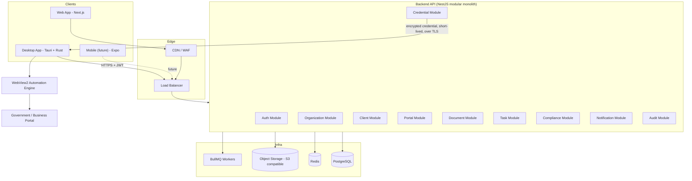
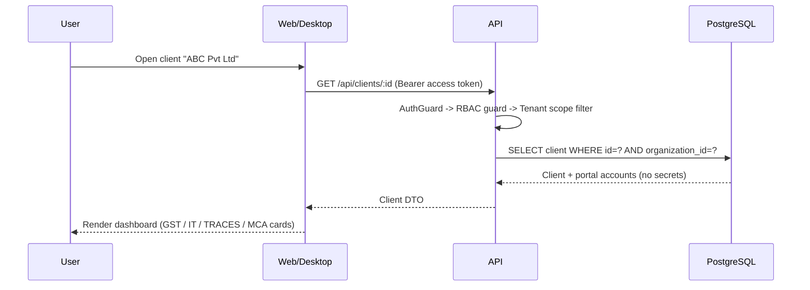
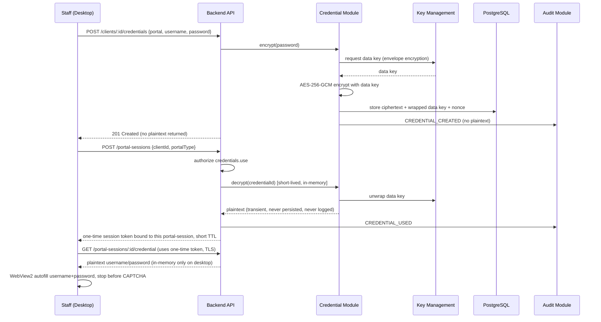
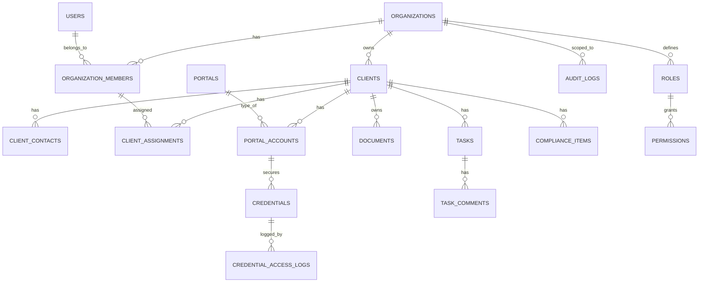

# System Design — Tax Professional Management Platform

Status: Draft v1 · Owner: Architecture · Last updated: 2026-08-24

## 1. Product Overview

A multi-tenant SaaS platform for Indian tax professionals (CAs, accountants, tax consultants,
CA firms) to manage clients, government/business portal credentials, documents, compliance
work, tasks, employees, and portal access from one secure system.

Three client applications share one backend:

| App | Users | Notes |
|---|---|---|
| Web application | All roles, any device | Primary admin/back-office surface |
| Windows desktop application | Staff who do daily portal work | Fast client switching + portal automation launcher |
| Mobile (future) | Not built now | Architecture must not require a backend rewrite to add it |

Non-goals (explicitly out of scope, permanently): bypassing CAPTCHA/OTP/MFA/anti-bot/rate
limits on any government or business portal. The product **assists** manual login; it never
automates authentication challenges.

## 2. Functional Requirements

- Firm (tenant) onboarding, employee management, RBAC.
- Client CRUD with Indian-entity-specific identifiers (PAN/GSTIN/TAN/CIN) and assignment to employees.
- Encrypted credential vault per client per portal, with controlled "use" flow (never displayed by default).
- Portal abstraction: GST, Income Tax, TRACES, MCA, EPFO, ESIC, DGFT, extensible to more without core changes.
- Desktop-driven portal launch: open portal, autofill username/password, stop at CAPTCHA/OTP/MFA for the human.
- Document storage (object storage + metadata), categorized, tagged, access-controlled.
- Task management: assignment, priority, due dates, comments, recurrence.
- Compliance tracking: configurable compliance types (not hard-coded rules), per client/FY/AY, status lifecycle.
- Notifications: in-app, email, desktop (push/WhatsApp are future extension points).
- Global search across clients/PAN/GSTIN/TAN/CIN/tasks/documents/employees.
- Full audit trail of security- and business-relevant events, especially credential access/use.

## 3. Non-Functional Requirements

| Category | Requirement |
|---|---|
| Security | Defense in depth; least privilege; nothing sensitive ever logged; encryption at rest for credentials and documents |
| Multi-tenancy | Hard tenant isolation enforced in the backend (never trust client-side checks) |
| Availability | Backend stateless & horizontally scalable; target 99.5% for MVP |
| Performance | P95 API latency < 300ms for standard CRUD; search < 500ms |
| Auditability | Every credential access/use and every privileged action is logged, immutable, queryable |
| Portability | Portal adapters pluggable without touching core domain code |
| Extensibility | Mobile client addable later via the same REST+token auth API, no rewrite |
| Compliance-readiness | Data residency-friendly (self-hostable), backups with defined RPO/RTO |

## 4. Architecture Style

**Modular monolith** for the backend MVP (NestJS), organized as clearly bounded modules
(Auth, Organization, Client, Credential, Portal, Document, Task, Compliance, Notification,
Audit) each with its own service/controller/repository layer and explicit module boundaries.
Rationale: a SaaS product at this stage doesn't have the team size, deployment maturity, or
scaling requirements to justify microservice operational overhead (service discovery,
distributed tracing, network-partition failure modes) on day one. Module boundaries are kept
strict (no cross-module repository access, only service-to-service calls) specifically so that
any module can be extracted into its own service later with minimal churn.

Desktop and web are both thin clients over the same REST API — no business logic is
duplicated client-side beyond optimistic UI and the portal-automation orchestration that must
run on the user's Windows machine (browser automation cannot run from a cloud backend without
exfiltrating credentials to the server process — see [browser-automation-design.md](browser-automation-design.md)).

## 5. High-Level Component Diagram

## 6. Data Flow Diagrams

### 6.1 Client dashboard load

### 6.2 Credential creation & use (see §10 for full flow)

## 7. Database ERD (summary — full schema in [database-design.md](database-design.md))

## 8. Authentication Flow

See [security-design.md](security-design.md) §2 for full detail. Summary: email+password ->
Argon2id verify -> short-lived JWT access token (15 min) + rotating opaque refresh token
(httpOnly cookie on web, OS-secure-storage on desktop) -> refresh-token rotation with reuse
detection -> session record in Redis/Postgres for revocation.

## 9. Authorization Flow

RBAC with a permission table decoupled from roles (`roles` grant `permissions`; a
`SUPER_ADMIN` platform role exists outside any organization for platform operators only).
Every request passes: `JwtAuthGuard` -> `TenantScopeGuard` (injects `organizationId` from the
token, not from the request body/params) -> `PermissionsGuard` (checks the required permission
string, e.g. `credentials.use`, against the caller's role-derived permission set) -> handler.
Full detail in [security-design.md](security-design.md) §4 and [database-design.md](database-design.md) §RBAC.

## 10. Credential Encryption Flow

Envelope encryption: a per-organization Data Encryption Key (DEK) encrypts each credential
with AES-256-GCM; the DEK itself is wrapped by a root Key Encryption Key (KEK) held in a
secrets manager (never in the database, never in source control). Detailed design, rotation
strategy, and desktop-side handling: [security-design.md](security-design.md) §5–§7.

## 11. Portal Login Workflow

Full design in [browser-automation-design.md](browser-automation-design.md). Summary:
`PortalAutomationAdapter` interface implemented per portal (GST, Income Tax, TRACES, MCA, ...),
driving a WebView2-hosted browser session from the Tauri desktop shell. The adapter fills only
username/password fields it is explicitly configured to fill, then transitions to
`awaiting_user_challenge` state and returns control to the human for CAPTCHA/OTP/MFA. No
adapter is permitted to read, solve, or programmatically submit a CAPTCHA/OTP field.

## 12. Desktop Architecture

See [desktop-architecture.md](desktop-architecture.md).

## 13. Browser Automation Architecture

See [browser-automation-design.md](browser-automation-design.md).

## 14. API Architecture

See [api-design.md](api-design.md).

## 15. Deployment Architecture

See [deployment.md](deployment.md).

## 16. Threat Model

See [threat-model.md](threat-model.md).

## 17. Disaster Recovery

See [deployment.md](deployment.md) §Backup & DR. Summary target: RPO ≤ 15 minutes (Postgres
WAL/point-in-time recovery + continuous object-storage replication), RTO ≤ 4 hours for full
environment rebuild from infrastructure-as-code + backups.

## 18. Scalability

Backend is stateless (all session state in Redis/Postgres) so it scales horizontally behind
the load balancer. Heavy/slow work (document virus scanning, notification fan-out, compliance
deadline scans) runs in BullMQ workers, not inline in request handlers. PostgreSQL is the
single source of truth for MVP; read replicas are an available lever before any move to
per-domain databases.

## 19. Testing Strategy

See [Testing Strategy](development-roadmap.md#testing-strategy) in the roadmap and the
`/tests` directory conventions. Minimum bar before any module is "done": unit tests for
service logic, integration tests for the module's API surface including negative
authorization/tenant-isolation cases, and a migration test for schema changes.

## 20. Development Roadmap

See [development-roadmap.md](development-roadmap.md).

## Document Index

| Doc | Purpose |
|---|---|
| [architecture.md](architecture.md) | Component architecture, module boundaries, tech stack rationale |
| [database-design.md](database-design.md) | Full schema, indexes, RBAC tables, multi-tenancy strategy |
| [security-design.md](security-design.md) | AuthN/AuthZ, credential vault, encryption, audit, desktop security |
| [api-design.md](api-design.md) | REST conventions, endpoint catalog, error format, OpenAPI |
| [desktop-architecture.md](desktop-architecture.md) | Tauri/Rust app structure, secure storage, UX |
| [browser-automation-design.md](browser-automation-design.md) | Browser strategy decision, adapter interface, CAPTCHA/OTP handling |
| [threat-model.md](threat-model.md) | STRIDE-based threat model and mitigations |
| [deployment.md](deployment.md) | Production topology, CI/CD, observability, backup/DR |
| [development-roadmap.md](development-roadmap.md) | Phased delivery plan, testing strategy |
| [security-review.md](security-review.md) | Pre-launch security review (filled in as implementation completes) |
