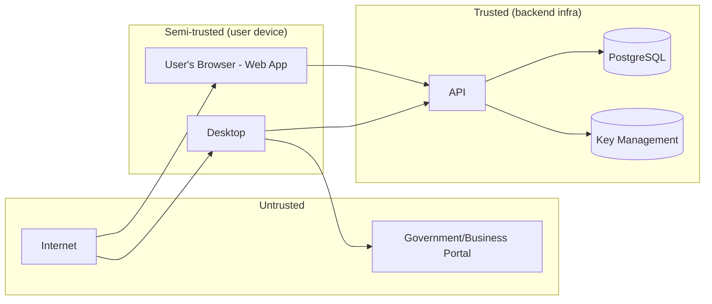

# Threat Model (STRIDE)

Scope: backend API, web app, desktop app, credential vault, portal automation. Out of scope:
physical security of the user's machine, and the security posture of the government/business
portals themselves (treated as an untrusted third party we integrate with, not a system we control).

## 1. Assets

- Portal credentials (highest sensitivity).
- Client PII/business data (PAN, GSTIN, financial documents).
- User authentication credentials (password hashes, tokens).
- Audit log integrity.
- Encryption keys (KEK/DEK).

## 2. Trust Boundaries

The desktop/web client is only semi-trusted: it can be inspected, debugged, and run on a
compromised machine. All authorization and cryptographic decisions happen inside the trusted
boundary (API + KMS); the client is handed only what it's currently authorized to have, for as
short a time as possible.

## 3. STRIDE Analysis

### Spoofing
| Threat | Mitigation |
|---|---|
| Attacker impersonates a user | Argon2id password hashing, rate-limited login, short-lived JWT + rotated refresh tokens, session revocation on suspicious reuse |
| Attacker impersonates the backend to the desktop app (MITM) | TLS certificate validation always enforced, cert pinning considered for desktop as a future hardening step |
| Forged JWT | RS256 asymmetric signing; only the auth service holds the private key; `JwtAuthGuard` verifies signature + expiry + issuer on every request |

### Tampering
| Threat | Mitigation |
|---|---|
| Modify credential ciphertext in the DB | AES-256-GCM is authenticated — tampered ciphertext fails decryption, doesn't silently return garbage credentials |
| Modify audit logs to hide activity | Append-only DB role grants (`INSERT`/`SELECT` only, no `UPDATE`/`DELETE`) on `audit_logs` |
| Tamper with portal page mid-automation (malicious page script) | Portal WebView is isolated from app WebView/IPC; automation only ever *writes* two fixed fields, never trusts page-returned data for authorization decisions |

### Repudiation
| Threat | Mitigation |
|---|---|
| User denies performing a credential-sensitive action | Every credential access/use is logged with actor, IP, user agent, timestamp, immutable |
| Desktop automation events not verifiable | Each portal-session lifecycle event is reported to and timestamped by the backend, not just logged client-side |

### Information Disclosure
| Threat | Mitigation |
|---|---|
| Plaintext credential leaked via logs | Structured-logger redaction denylist, lint rule, code review checklist (§ [security-design.md](security-design.md) §7) |
| Cross-tenant data leak | Dual-layer tenant isolation: app-layer mandatory `organizationId` filter + Postgres RLS (§ [database-design.md](database-design.md) §1) |
| Credential exposed via `reveal` endpoint misuse | Step-up re-auth required, org-level kill switch, every reveal audited |
| Stolen laptop/desktop exposes cached data | No plaintext secrets on disk; refresh token in DPAPI-backed Credential Manager (OS-user-bound); idle lock + step-up for sensitive actions |
| Object storage bucket misconfiguration exposes documents | Private bucket by default, access only via short-lived signed URLs generated per authorized request, checked in IaC review |
| KEK compromise | Per-org DEKs bound blast radius; KEK lives in KMS/Vault, never in app memory beyond wrap/unwrap calls; rotation runbook in [security-design.md](security-design.md) §5 |

### Denial of Service
| Threat | Mitigation |
|---|---|
| Credential-stuffing / brute force login | Throttling + backoff per (email, ip), Redis-backed |
| API flooding | Global rate limiter, WAF in front of load balancer, horizontal scaling of stateless API |
| Automation engine hammering a portal, tripping the portal's own anti-bot defenses (which would look like an attack from *this product*, harming the tenant firm's own access) | No auto-retry loop; every login is one human-initiated attempt; explicit design rule against retry-storming a portal (§ [browser-automation-design.md](browser-automation-design.md) §6) |

### Elevation of Privilege
| Threat | Mitigation |
|---|---|
| STAFF role reaching FIRM_ADMIN-only endpoints | `PermissionsGuard` on every handler, permission set resolved server-side, never trusts client-declared role |
| Privilege escalation via IDOR (accessing another org's resource by guessing an ID) | Tenant scope enforced independent of resource ID — a valid UUID for another org's client 404s, not 403 (avoids confirming existence) |
| Compromised desktop binary requesting elevated API scopes | Access tokens carry only `sub`/`orgId`/`sessionId`; server resolves current permissions per request, so a modified client can't self-grant permissions it doesn't have server-side |

## 4. Abuse-Case: Attempted CAPTCHA/OTP Bypass Feature Request

Explicitly documented because it will come up: if a future request (internal or from a
customer) asks for CAPTCHA-solving, OTP auto-read (e.g. via SMS forwarding), or session-cookie
reuse to "skip login," the answer is no — this is a permanent product constraint, not a
prioritization decision, per [security-design.md](security-design.md) §1 and §11. Any such
request should be redirected toward what's actually allowed: reducing clicks around the
manual challenge (e.g. clearer prompts, one-click "I've completed the challenge, continue").

## 5. Residual Risk

- A fully compromised, actively-controlled desktop machine (malware with OS-admin rights) can
  observe credentials at the moment of legitimate use — this is accepted residual risk common
  to any credential manager; mitigations are OS-level (the product cannot defend against a
  fully owned endpoint) and organizational (encourage firm-level endpoint security policy).
- Government portal-side vulnerabilities (e.g. a portal's own weak session handling) are
  outside this product's control; the product's obligation is to never make that worse.
